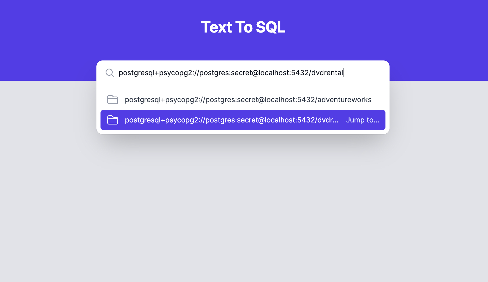
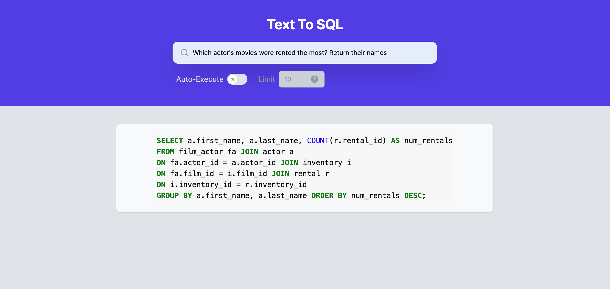
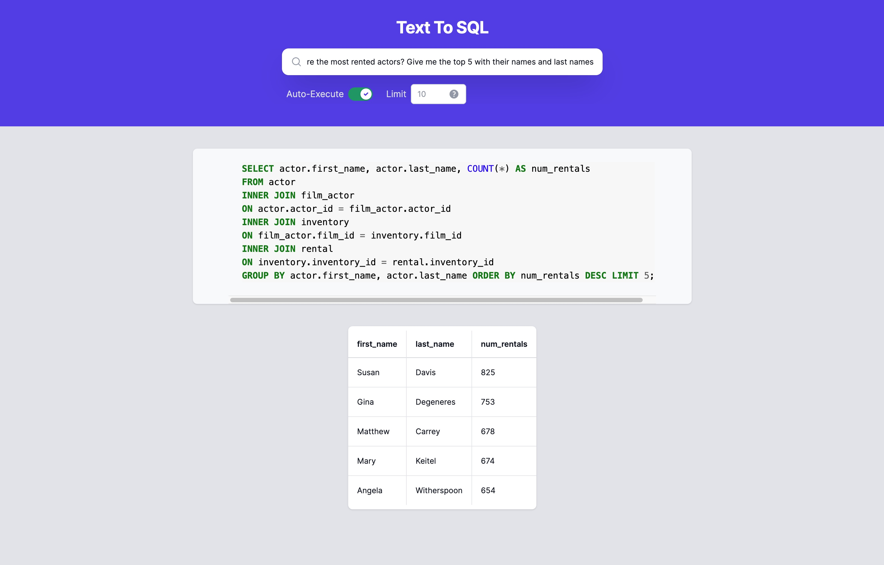

# Text To SQL


## What is it?
An app that plugs into your database and uses the schema information to generate SQL queries for you out of natural language queries!


More technically, it's an interface for using LLMs with context for SQL query generation and execution.
The application flow is 1) connect your database 2) start querying.




This allows the app to fetch the table schemas from the database, create an index of {word vector: schema} out of them, then respond to queries by sending the "relevant" parts of your database schema to the LLM as context.


<br/>

## Why is this useful?

Can't we just send our database schema as context to an LLM? Yes, if it's small enough, which is nearly never the case for databases used in the real world. But also, sending extra information might hurt the prompt quality.
We assume that sending just the right parts of the schema improves the results generally.

<br/>


## What can it do?

It can auto-execute queries and limit the results, or simply return the generated SQL query for the user to do what they please with.

Confession: I still don't know what's in this DVDRENTAL sample database OR how it's structured, which makes it all the more interesting to get results from natural language queries. Exploring a database with natural language questions is as smooth as it gets!


## Why isn't this hosted somewhere?

The whole point of such a tool is plugging into YOUR database to allow for NL queries! If I did host it somewhere, how could I plug it into your databases? Technically it's feasible with tunneling-black-magic, but would you even touch something like that and trust it with your precious data? Didn't think so.


### Here is an example without auto execution:




### Here is an example with slightly inaccurate wording (highest rented) and with no indication as to how the database is structured. The limit here is generated by the query, so the user-inputted limit is ignored.


This isn't satisfactory enough, so let's ask it to bring in their names as well!



## Where is this going?

I'm adding upcoming tasks/ideas on this [Github project page](https://github.com/users/RamiAwar/projects/4). Some ideas from the community were: Iterative UI (adjust query through conversation), being able to plug in any LLM (since they're becoming more local), auto-charting query results to generate reports, and more. If you an idea, please create an issue!


## What is this based on?

This is based on the amazing Llamaindex and Langchain, which made it very easy to build the backend part of this in just one day. Wrapping it with a sleek UI took a bit longer however.

Here is a guide to a slightly simpler version of what the text2sql backend does: https://gpt-index.readthedocs.io/en/latest/guides/tutorials/sql_guide.html


### Running this

For the backend, simple FastAPI app with poetry. Make sure you have the latest poetry installed, and an OPENAI API KEY configured in your .env file as (OPENAI_API_KEY=...):

```bash
poetry install
uvicorn main:app --reload --port=7377
```

For the frontend, React app with npm (started off as Svelte, then moved to React to allow more people to contribute)
```bash
npm i
npm run dev
```
