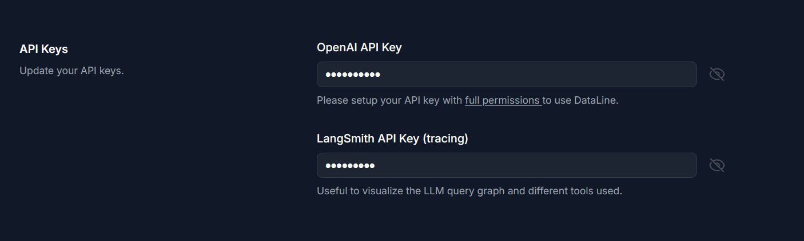

# Dataline Backend

- [Installation](#installation)
- [Environment setup](#environment-setup)
- [Running the backend](#running-the-backend)
- [Current state](#current-state)
  - [pre-commit](#pre-commit)

## Installation

Make sure you have poetry installed from their official website.
If you have multiple python versions, do: `poetry env use python3.11`.
We're going with 3.11 for now cause of all the nice features.

```bash
poetry config virtualenvs.in-project true
poetry install --no-root
```

# Define a custom SQLITE_PATH

```
SQLITE_PATH="." # Define where sqlite DB will be stored

poetry shell # Active python environment (makes alembic command available)
alembic upgrade head # Run migrations
```

# CORS settings
Set the environment variable `ALLOWED_ORIGINS` to a comma-separated list of origins if you're deploying this to a custom domain.

## Environment setup

Currently, the environment can be setup through the settings page on the frontend.



You only need an OpenAI API key to start using DataLine. You may optionally use Langsmith to record logs for your LLM flow.

!NOTE that adding Langsmith will send the graph state to Langsmith to log. The graph state includes your **private results**. Only enable this feature if you are okay with sharing your data with Langsmith. We use this mainly for debugging during development.

## Running the backend

Run migrations if needed:

```bash
python -m alembic upgrade head
```

You can then run uvicorn to start the backend:

```bash
uvicorn dataline.main:app --reload --port=7377
```

To run tests: `PYTHONPATH=. pytest . -vv`

## Current state

They stay if you ship something you're proud of, you've shipped too late.

- ~~Currently some raw SQL from the very early MVP remains and is being replaced with SQLAlchemy queries.~~
- ~~The LLM querying code is also pretty non-generic and hard to extend, so that will soon be replaced with some "Agent" implementation.~~

### pre-commit

```
pre-commit install
```
